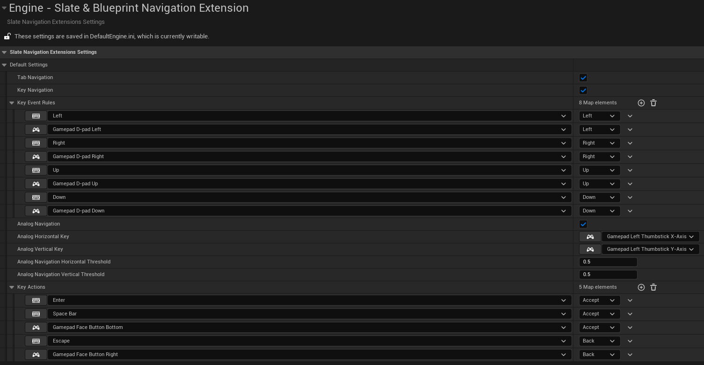
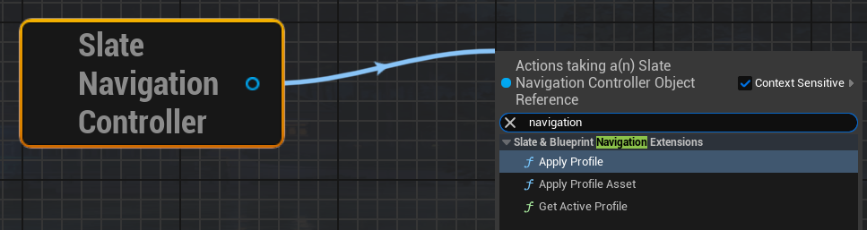
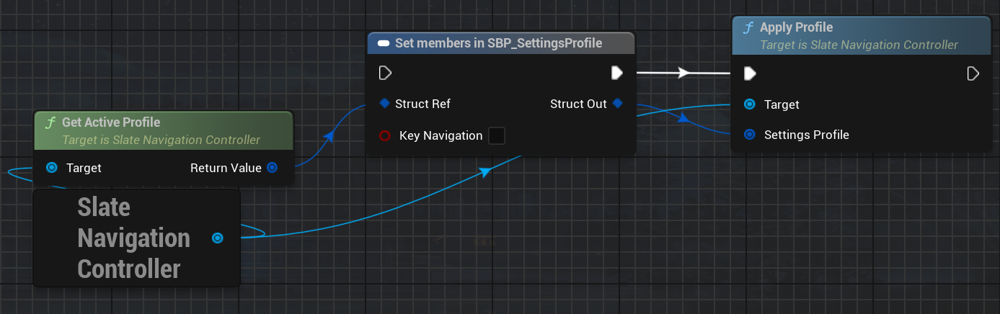

# Slate Blueprints Navigation Extension

This plugin allows to customize Slate navigation config from blueprints.

## Installation

Clone the repository in your project's Plugin directory.

## Usage

If you want to apply the config immediately after the game starts, go to Project Settings -> Engine -> Slate &
Blueprints Navigation Extension, and edit the settings you are presented with.

The plugin comes with an ability to change the config during runtime as well. There are a few functions you can find in
Slate Navigation Controller. They are pretty straightforward.

To change a particular property in the existing settings you can do the following:

